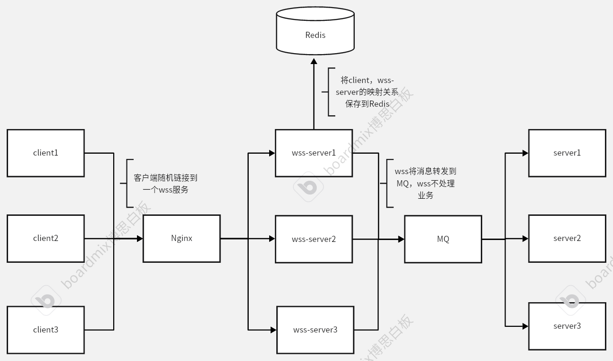
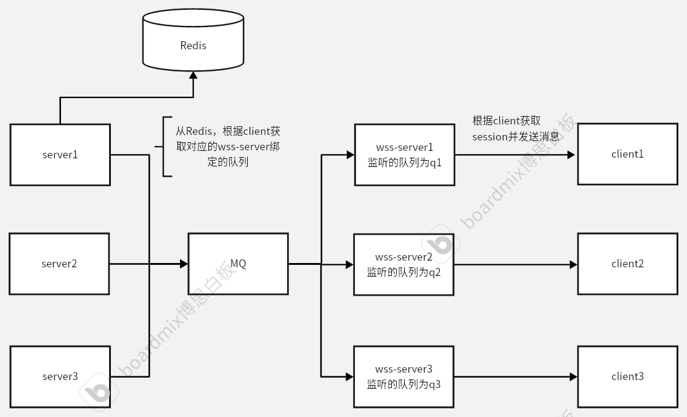

# WebSocket 服务部署与使用文档

## 架构概述

本系统采用分布式WebSocket服务架构，通过多层级组件协同工作，实现高并发、高可用的实时通信能力。系统核心设计理念是通过水平扩展WebSocket服务节点来提升连接容量，同时利用中间件实现请求分流和状态管理。

客户端->服务端


服务端->客户端


## 快速开始

### 1. 启用 WebSocket 服务

```java
@EnableSocket
@ProxyScan("cn.org.alice.demo.service")
@SpringBootApplication
public class Application {
    public static void main(String[] args) {
        SpringApplication.run(Application.class, args);
    }

    @Bean
    public ServerEndpointExporter serverEndpointExporter() {
        return new ServerEndpointExporter();
    }
}
```

### 2. 必要配置

```yaml
spring:
  application:
    uuid: server-00001  # 每个 WSS 服务唯一标识, 也是MQ的监听的队列名
    name: test-receiver-user
  
  activemq:
    broker-url: tcp://172.16.0.8:61616
    inMemory: true
    pool:
      enabled: false
  
  data:
    redis:
      host: 172.16.0.4
      password: luo122333
      port: 6379
      timeout: 10000

alice:
  wss:
    client-prefix: "wss-client"      # MQ 路由键前缀
    redis-primary-prefix: "wss-primary"  # Redis 键前缀
```

## 功能实现

### 接收客户端消息

客户端发送的消息格式：
```json
{
    "link": "/test/save",
    "data": {
        "name": "alice",
        "age": 18
    }
}
```

服务端处理代码示例：

```java
@Slf4j
@WssClientController
@WssRequestMapping("/test")
public class DemoController {

    @Autowired
    private MessageSender messageSender;

    @WssRequestMapping("/save")
    public void save(@WssRequestBody User user, @WssPrimary String id) {
        log.info("收到客户端消息: {}", user);
        messageSender.convertAndSend(id, "test-receiver-user", user);
    }
}
```

### 向客户端发送消息

1. 定义接口：

```java
@WebSocketRegister
public interface ReplyService {
    
    @WssRequestMapping("reply")
    void reply(@WssRequestBody Body body, @WssPrimary String user1);

    @WssRequestMapping("reply2")
    void reply2(@WssRequestBody Body body, @WssPrimary String user2);
}
```

2. 调用发送：

```java
@Autowired
private ReplyService replyService;

public void sendMessage(String primary) {
    replyService.reply(
        Body.builder().message("this is message").build(), 
        primary
    );
}
```

客户端接收格式：
```json
{
  "link": "reply",
  "data": {
    "message": "hello "
  }
}
```

### 处理远程 MQ 消息

```java
@Component
public class OnRemoteMessageListener implements ApplicationListener<OnRemoteMessageEvent> {

    @Autowired
    private ReplyService replyService;

    @Override
    public void onApplicationEvent(OnRemoteMessageEvent event) {
        RemoteMessageData data = event.getRemoteMessageData();
        replyService.reply(
            Body.builder().message("hello ").build(), 
            data.getPrimary()
        );
    }
}
```

### Nginx配置
```nginx
upstream wss_servers { 
    least_conn;  # 优先选择当前连接数最少的服务器
    server 172.16.0.205:8080;
    server 172.16.0.206:8080;
    server 172.16.0.207:8080;
}

server {
    listen 80;
    server_name wss.myzone.com;

    location / {
        proxy_pass http://wss_servers;
        proxy_http_version 1.1;
        proxy_set_header Upgrade $http_upgrade;
        proxy_set_header Connection "upgrade";
        proxy_set_header Host $host;

        # 可选：添加超时设置
        proxy_connect_timeout 7d;
        proxy_send_timeout 7d;
        proxy_read_timeout 7d;
    }

    # 可选：HTTP重定向到HTTPS（如果同时提供HTTPS服务）
    # return 301 https://$host$request_uri;
}
```
你可以使用下述方式链接wss
#### wss://wss.myzone.com/socket/1000
#### wss://wss.myzone.com/socket/1001
#### wss://wss.myzone.com/socket/1002

## 最佳实践

1. **多 WSS 服务部署**：
    - 每个 WSS 服务配置不同的 `spring.application.uuid`
    - 使用 Nginx 实现负载均衡

2. **Redis 映射**：
    - 主服务通过 Redis 查询客户端所在 WSS 服务
    - 使用 `redis-primary-prefix` 作为键前缀

3. **MQ 通信**：
    - WSS 服务与主服务通过 ActiveMQ 通信
    - 使用 `client-prefix` 作为路由键前缀

4. **其它**：
    - wss系统不建议进行业务操作
